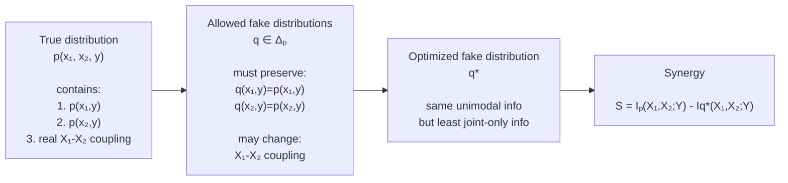
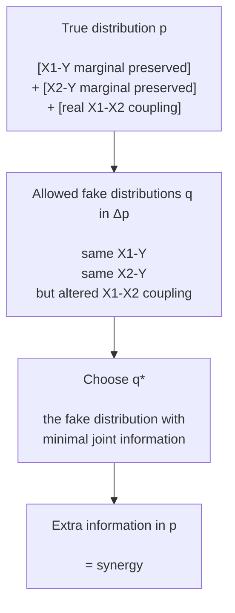

## 0. What this paper is trying to answer

The paper studies a basic problem in multimodal learning:

> Given two modalities and a prediction target, what kind of information does the task require?

Let:

$$
X_1 = \text{modality 1}
$$

$$
X_2 = \text{modality 2}
$$

$$
Y = \text{task label / target}
$$

For example:

| Domain | \(X_1\) | \(X_2\) | \(Y\) |
|---|---|---|---|
| Vision-language | image | text | answer / class |
| Audio-visual | audio | video | emotion |
| CIRR | reference image | modification text | target image |
| Medical multimodal learning | pathology image | clinical data | diagnosis |

The key question is:

> Does the task require redundant, unique, or synergistic information?

This paper uses **Partial Information Decomposition**, or **PID**, to quantify these interaction types.

---

# 1. Probability foundation

Before understanding PID, we need to understand the distribution:

$$
p(x_1,x_2,y)
$$

This is the full joint distribution of the two input modalities and the target.

From this full distribution, we can compute marginals:

$$
p(x_1,y)=\sum_{x_2}p(x_1,x_2,y)
$$

$$
p(x_2,y)=\sum_{x_1}p(x_1,x_2,y)
$$

$$
p(y)=\sum_{x_1}\sum_{x_2}p(x_1,x_2,y)
$$

Interpretation:

| Distribution | Meaning |
|---|---|
| \(p(x_1,x_2,y)\) | full multimodal relationship |
| \(p(x_1,y)\) | how modality 1 alone relates to the target |
| \(p(x_2,y)\) | how modality 2 alone relates to the target |
| \(p(y)\) | target distribution |

In this paper, the marginals \(p(x_1,y)\) and \(p(x_2,y)\) are very important because they represent the **unimodal relationships**.

---

# 2. Entropy

Entropy measures uncertainty.

For a random variable \(Y\):

$$
H(Y)=-\sum_y p(y)\log p(y)
$$

Interpretation:

> How uncertain are we about \(Y\) before seeing any input?

If \(Y\) is deterministic, entropy is low.

If \(Y\) is uniformly distributed over many possible outcomes, entropy is high.

## Figure 1: Binary entropy curve

![[Pasted image 20260703101112.png]]

Use this figure to remember:

- entropy is 0 when the outcome is certain;
    
- entropy is maximal when both outcomes are equally likely.
    

---

# 3. Conditional entropy

Conditional entropy measures remaining uncertainty after observing another variable.

$$  
H(Y|X_1)  
$$

means:

> How uncertain are we about (Y) after observing (X_1)?

Formula:

 $$  
H(Y|X_1)

-\sum_{x_1,y}p(x_1,y)\log p(y|x_1)  
$$

If (X_1) is useful for predicting (Y), then:

$$  
H(Y|X_1)<H(Y)  
$$

If (X_1) tells us nothing about (Y), then:

$$  
H(Y|X_1)=H(Y)  
$$

For multimodal learning:

$$  
H(Y|X_1)  
$$

means uncertainty about the target after seeing modality 1.

$$  
H(Y|X_2)  
$$

means uncertainty about the target after seeing modality 2.

$$  
H(Y|X_1,X_2)  
$$

means uncertainty about the target after seeing both modalities.

---

# 4. Mutual information

Mutual information measures uncertainty reduction.

$$  
I(X_1;Y)=H(Y)-H(Y|X_1)  
$$

Interpretation:

> How much does (X_1) reduce uncertainty about (Y)?

Similarly:

$$  
I(X_2;Y)=H(Y)-H(Y|X_2)  
$$

and:

$$  
I(X_1,X_2;Y)=H(Y)-H(Y|X_1,X_2)  
$$

In multimodal learning:

|Quantity|Meaning|
|---|---|
|(I(X_1;Y))|information modality 1 has about the target|
|(I(X_2;Y))|information modality 2 has about the target|
|(I(X_1,X_2;Y))|information both modalities together have about the target|

## Figure 2: Entropy and mutual information Venn diagram

![[Pasted image 20260703101249.png]]
This figure is useful for remembering:

$$  
I(X;Y)=H(X)+H(Y)-H(X,Y)  
$$

and:

$$  
I(X;Y)=H(Y)-H(Y|X)  
$$

---

# 5. Why mutual information is not enough

Suppose we compute:

$$  
I(X_1,X_2;Y)  
$$

This tells us how much information both modalities together provide about (Y).

But it does **not** tell us how the information is organized.

The information could be:

1. redundant,
    
2. unique to (X_1),
    
3. unique to (X_2),
    
4. synergistic.
    

Example:

|Case|(X_1)|(X_2)|Meaning|
|---|---|---|---|
|Redundancy|useful|useful|both contain same information|
|Unique (X_1)|useful|not useful|only (X_1) helps|
|Unique (X_2)|not useful|useful|only (X_2) helps|
|Synergy|not useful alone|not useful alone|only together they help|

So standard mutual information cannot answer:

> Did the task require true multimodal interaction?

This is why we need PID.

---

# 6. The core idea of PID

Partial Information Decomposition decomposes:

$$  
I(X_1,X_2;Y)  
$$

into four parts:

$$  
I(X_1,X_2;Y)
=
R + U_1 + U_2 + S  
$$

where:

| Term  | Name                          | Meaning                                                      |
| ----- | ----------------------------- | ------------------------------------------------------------ |
| (R)   | redundancy                    | information about (Y) shared by both (X_1) and (X_2)         |
| (U_1) | unique information from (X_1) | information only (X_1) provides                              |
| (U_2) | unique information from (X_2) | information only (X_2) provides                              |
| (S)   | synergy                       | information only available when (X_1) and (X_2) are combined |

## Figure 3: PID decomposition diagram from the paper

![[Pasted image 20260703101524.png]]

Figure 1 in the paper shows how classical information theory is extended into PID:

- classical three-way interaction can mix redundancy and synergy;
    
- PID separates them into (R), (U_1), (U_2), and (S).
    

---

# 7. Intuition for the four PID components

## 7.1 Redundancy

Redundancy means both modalities contain the same task-relevant information.

Example:

$$  
X_1 = Y  
$$

$$  
X_2 = Y  
$$

Both (X_1) and (X_2) tell us the label.

In VLM terms:

![[Pasted image 20260703104408.png]]

```text
Image: clearly shows a dog.
Text: "a dog is in the image."
Target: dog.
```

Either modality is enough.

So the information is redundant.

---

## 7.2 Unique information from (X_1)

Unique information from (X_1) means only modality 1 contains the relevant signal.

Example:

$$  
X_1 = Y  
$$

$$  
X_2 = \text{noise}  
$$

In VLM terms:

![[Pasted image 20260703104623.png]]

```text
Image: shows the object color.
Text: generic instruction, no useful clue.
Target: object color.
```

Only the image helps.

---

## 7.3 Unique information from (X_2)

Unique information from (X_2) means only modality 2 contains the relevant signal.

Example:

$$  
X_1 = \text{noise}  
$$

$$  
X_2 = Y  
$$

In VLM terms:

```text
Image: ambiguous product photo.
Text: "released in 2024."
Target: release year.
```

Only the text helps.

---

## 7.4 Synergy

Synergy means neither modality alone is sufficient, but both together are informative.

The canonical example is XOR:

$$  
Y = X_1 \oplus X_2  
$$

Truth table:

|(X_1)|(X_2)|(Y)|
|---|---|---|
|0|0|0|
|0|1|1|
|1|0|1|
|1|1|0|

For XOR:

$$  
I(X_1;Y)=0  
$$

$$  
I(X_2;Y)=0  
$$

but:

$$  
I(X_1,X_2;Y)=1  
$$

So all information is synergistic.

![[Pasted image 20260703105136.png]]

In VLM terms:

```text
Image: two people, one holding a red cup.
Text: "The person holding the cup is Alice."
Question: "What color cup is Alice holding?"
Answer: red.
```

Image alone does not identify Alice.

Text alone does not reveal the cup color.

Together, they answer the question.

---

# 8. Why three-way mutual information is problematic

A tempting quantity is three-way mutual information:

$$  
I(X_1;X_2;Y)  
$$

One form is:

 $$  
I(X_1;X_2;Y)
=
I(X_1;X_2)-I(X_1;X_2|Y)  
$$

![[Pasted image 20260703110214.png]]
The problem:

> This quantity can be positive or negative.

Positive values are often interpreted as redundancy.

Negative values are often interpreted as synergy.

But this is dangerous because redundancy and synergy can cancel each other.

The paper emphasizes that PID is useful because it separates redundancy and synergy instead of mixing them.

---

# 9. BROJA / Bertschinger-style PID idea

The paper adopts a PID definition based on Bertschinger et al.

The main trick is to construct a fake distribution (q).

The true distribution is:

$$  
p(x_1,x_2,y)  
$$

Now define a set of fake distributions:

 $$  
\Delta_p

{q: q(x_1,y)=p(x_1,y),\ q(x_2,y)=p(x_2,y)}  
$$

This means:

> (q) must preserve the relationship between (X_1) and (Y), and between (X_2) and (Y).

But (q) is allowed to change the coupling between (X_1) and (X_2).

In other words:

- (q(x_1,y)) must match (p(x_1,y));
    
- (q(x_2,y)) must match (p(x_2,y));
    
- but (q(x_1,x_2,y)) can differ from (p(x_1,x_2,y)).
    



---

# 10. Why preserve (p(x_1,y)) and (p(x_2,y))?

Because these two marginals represent the unimodal relationships.

$$  
p(x_1,y)  
$$

contains what modality 1 alone knows about the target.

$$  
p(x_2,y)  
$$

contains what modality 2 alone knows about the target.

So if (q) preserves these marginals, then (q) preserves the unimodal information.

But (q) can still alter joint-only information.

Therefore, any extra information in the real distribution (p) that cannot be explained under (q) is attributed to synergy.

---

# 11. PID definitions used by the paper

The paper defines PID quantities using optimization over (q \in \Delta_p).

Redundancy:

$$  
R = \max_{q\in \Delta_p} I_q(X_1;X_2;Y)  
$$

Unique information:

$$  
U_1 = \min_{q\in \Delta_p} I_q(X_1;Y|X_2)  
$$

$$  
U_2 = \min_{q\in \Delta_p} I_q(X_2;Y|X_1)  
$$

Synergy:
 $$  
S

= I_p(X_1,X_2;Y) -

\min_{q\in \Delta_p} I_q(X_1,X_2;Y)  
$$

The most important one for intuition is synergy:

$$  
S

= \text{real joint information} -

\text{minimum joint information preserving unimodal marginals}  
$$

Meaning:

> Synergy is the extra joint information in the real distribution that cannot be explained by either modality's individual relationship with the target.

---

# 12. Visual intuition for (p) versus (q)

Think of (p) as the real world:

```text
p = redundancy + unique X1 + unique X2 + synergy
```

Think of optimized (q^*) as a fake world where unimodal relationships are preserved but joint-only interaction is minimized:

```text
q* = redundancy + unique X1 + unique X2
```

Then:

```text
p - q* = synergy
```

More precisely:

$$  
S

= I_p(X_1,X_2;Y)
-
I_{q^*}(X_1,X_2;Y)  
$$

## Figure 4: Suggested custom illustration


There may not be a standard public figure for this exact intuition, so this is a good figure to draw yourself.

---

# 13. Why estimation is hard

For tiny discrete variables, we can compute PID exactly.

But multimodal data is high-dimensional:

$$  
X_1 = \text{image embedding}  
$$

$$  
X_2 = \text{text embedding}  
$$

$$  
Y = \text{label / prediction}  
$$

The full distribution:

$$  
p(x_1,x_2,y)  
$$

is impossible to know exactly.

So the paper needs estimators.

The paper proposes two estimators:

|Estimator|Main idea|
|---|---|
|CVX|exact convex optimization for discrete/support-limited variables|
|BATCH|approximate sampling-based estimator for large or continuous variables|

---

# 14. CVX estimator foundation

CVX is used when (X_1), (X_2), and (Y) have manageable discrete support.

The distribution can be represented as a tensor:

$$  
Q[i,j,k] = q(X_1=i, X_2=j, Y=k)  
$$

The optimization searches over valid (Q) such that:

$$  
q(x_1,y)=p(x_1,y)  
$$

$$  
q(x_2,y)=p(x_2,y)  
$$

The paper notes that the optimization can be solved through a maximum conditional entropy form:

$$  
q^* = \arg\max_{q\in \Delta_p} H_q(Y|X_1,X_2)  
$$

Intuition:

> Maximize uncertainty about (Y) after seeing both modalities, while preserving each modality's individual relationship with (Y).

This removes as much joint-only information as possible.

---

# 15. BATCH Estimator Foundation  
  
## 15.1 Why do we need BATCH?  
  
The original PID definition requires optimizing over a full joint distribution:  
  
$$  
q(x_1, x_2, y)  
$$  
  
For small discrete variables, this is possible.  
  
For example, if:  
  
$$  
|X_1|=10,\quad |X_2|=10,\quad |Y|=5  
$$  
  
then the joint table has:  
  
$$  
10 \times 10 \times 5 = 500  
$$  
  
entries.  
  
This is manageable.  
  
But in real multimodal learning:  
  
$$  
X_1 = \text{image feature}  
$$  
  
$$  
X_2 = \text{text / audio / video feature}  
$$  
  
These features may be continuous and high-dimensional.  
  
For example:  
  
$$  
X_1 \in \mathbb{R}^{768}  
$$  
  
$$  
X_2 \in \mathbb{R}^{768}  
$$  
  
Then we cannot explicitly build a full probability table:  
  
$$  
q(x_1,x_2,y)  
$$  
  
because almost every sample has a unique feature value.  
  
So BATCH is introduced to approximate PID without explicitly storing the full joint distribution.  
  
The paper describes BATCH as an estimator for large datasets where \(X_i\) is high-dimensional or continuous, while \(Y\) remains finite. It parameterizes marginal-matching joint distributions with neural networks and optimizes them using minibatches.

## 15.2 Illustration

```mermaid
flowchart TD
    D["Large multimodal dataset D<br/><br/>(x1, x2, y) samples<br/>high-dimensional / continuous features"]

    B["Sample a mini-batch<br/><br/>m examples from D"]

    E1["Encoder for X1<br/><br/>f₁(x1, y)"]
    E2["Encoder for X2<br/><br/>f₂(x2, y)"]

    A["Build score tensor A<br/><br/>A[i,j,y] ≈ q̃(x1ᵢ, x2ⱼ, y)<br/><br/>shape: m × m × |Y|"]

    S["Sinkhorn normalization<br/><br/>force batch-level marginal constraints:<br/>q̃(x1,y) ≈ p(x1,y)<br/>q̃(x2,y) ≈ p(x2,y)"]

    Q["Normalized fake distribution q̃<br/><br/>same unimodal information<br/>altered X1-X2 coupling"]

    O["Optimize information objective<br/><br/>maximize co-information / compute PID terms"]

    PID["Approximate PID values<br/><br/>R, U1, U2, S"]

    D --> B
    B --> E1
    B --> E2
    E1 --> A
    E2 --> A
    A --> S
    S --> Q
    Q --> O
    O --> PID
````

Readmore [[Batch_estimator]]

---

# 16. Why Sinkhorn appears

The BATCH estimator uses Sinkhorn-style normalization.

Sinkhorn is useful when we want to construct a soft joint distribution with fixed marginals.

Given a score matrix, Sinkhorn repeatedly normalizes rows and columns until the desired marginal constraints are satisfied.

In this context, the goal is conceptually similar:

> Find a soft distribution (q) that preserves certain marginals while changing the joint coupling.

So Sinkhorn is a computational tool for enforcing marginal constraints.

![[Pasted image 20260703120650.png]]

---

# 17. Synthetic examples used for intuition

The paper validates PID estimation using synthetic datasets where the expected interaction type is known.

Important examples:

## OR / AND

These have both redundancy and synergy-like structure depending on the distribution.

They are not pure synergy.

## XOR

XOR is the cleanest pure synergy example.

For XOR:

$$  
I(X_1;Y)=0  
$$

$$  
I(X_2;Y)=0  
$$

$$  
I(X_1,X_2;Y)>0  
$$

Therefore:

$$  
S > 0  
$$

and:

$$  
R=U_1=U_2=0  
$$


---

# 18. How this connects to multimodal learning

In multimodal learning, we often say models need to learn "interactions."

But "interaction" can mean different things.

PID gives a more precise vocabulary:

|Interaction type|Multimodal meaning|
|---|---|
|Redundancy|modalities provide overlapping evidence|
|Unique (X_1)|only modality 1 provides useful evidence|
|Unique (X_2)|only modality 2 provides useful evidence|
|Synergy|target requires combining modalities|

This matters because different model architectures may capture different interactions.

For example:

|Model type|Likely strength|
|---|---|
|contrastive learning|redundancy/alignment|
|modality-specific encoders|unique information|
|multiplicative/tensor fusion|higher-order interactions|
|cross-attention|conditional interaction between modalities|

The paper uses PID statistics to quantify both:

1. the interaction structure of datasets;
    
2. the interaction structure captured by models.
    

---

# 19. Connection to CIRR

For CIRR:

$$  
X_1 = \text{reference image}  
$$

$$  
X_2 = \text{modification text}  
$$

$$  
Y = \text{target image}  
$$

Standard CIRR asks:

$$  
f(X_1,X_2) \rightarrow Y  
$$

But a correct retrieval can happen for different reasons:

|Case|Meaning|
|---|---|
|image-sufficient|reference image alone retrieves the target|
|text-sufficient|modification text alone retrieves the target|
|redundant|either modality independently retrieves the target|
|composition-required|only image + text retrieves the target|
|unresolved|none retrieves the target|

PID motivates this question:

> Is the target information available in each modality alone, or only in their joint composition?

For your own CIRR formulation, you can define:

$$  
A_I^K(i)=\mathbb{1}[t_i \in \text{TopK}(s_I(r_i,C_i))]  
$$

$$  
A_T^K(i)=\mathbb{1}[t_i \in \text{TopK}(s_T(m_i,C_i))]  
$$

$$  
A_C^K(i)=\mathbb{1}[t_i \in \text{TopK}(s_C(r_i,m_i,C_i))]  
$$

Then:

 $$  
\text{CompositionRequired}^K(i)

(1-A_I^K(i))(1-A_T^K(i))A_C^K(i)  
$$

